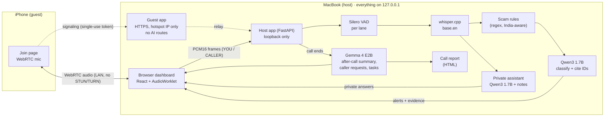

# CallPilot AI

> A private AI copilot for phone calls that runs **entirely on your Mac**. It hears both sides, flags scam requests.
> (OTP, UPI PIN, "digital arrest", money transfers) the moment they are spoken, and answers your questions from your own notes.
> **Gemma 4** writes the after-call summary. The caller never sees any of it.

[](https://github.com/ManoharPaturi/techie-cooks-callpilot-ai/actions/workflows/ci.yml)
[](LICENSE)


## Team

**Team Name:** Techie Cooks

| Member | Contribution |
| ------ | ------------ |
| Manohar P (Team Lead) | Architecture, backend pipeline, local models, live-call networking, submission |
| Sainath B | _To be filled in by the team_ |
| Pushpak K | _To be filled in by the team_ |
| Laasya B | _To be filled in by the team_ |

## Problem Statement

### The Problem

Phone scams in India have become a script: a caller claims to be your bank's "fraud team", a courier, or the CBI. They create
panic ("your account will be blocked", "you are under digital arrest"), then ask for an OTP, a UPI PIN, a remote-access app or
a "safe account" transfer. Victims are often older people, first-time smartphone users, and busy people on a call they
didn't expect. The warning signs are clear in hindsight but easy to miss under pressure, while the call is still going on.

Existing protections act either **before** the call (caller-ID spam labels, which new numbers evade) or **after** the money is gone
(reporting on 1930 / cybercrime.gov.in). Nothing helps **during** the conversation. Cloud call assistants that could help mean
sending private calls to a server.

### Why We Chose This Problem

Everyone on our team knows someone who has received one of these calls. The scripts are repetitive and well documented, so
a model can recognise them, but only if it hears the call as it happens and keeps the call private. Small open-weight models
can now run on a normal 8 GB laptop, which makes a fully local, real-time copilot possible for the first time.

## Solution

CallPilot sits beside a call on the user's Mac. It transcribes both sides in two lanes (**YOU** = Mac microphone,
**CALLER** = the phone), checks every caller sentence for scam patterns with rules plus a local model, and shows a
plain-language warning with the exact words that triggered it. A private assistant answers "what is this call about?",
"do I have to share this?" or "is bulk upload in our contract?" from the conversation and the user's own notes. When the call
ends, **Gemma 4** writes a summary, lists what the caller asked for, and proposes protective follow-ups.


### Key Features

- **Live scam alerts with evidence:**
  - Covers OTP / security codes, UPI PIN "refunds", passwords, remote-access apps (AnyDesk), KYC / Aadhaar / SIM-block threats, fake
    "digital arrest" (CBI / police / customs), parcel scams, money transfers and pressure tactics.
  - Every alert quotes the caller's exact line.
- **Hang-up banner:** after two red alerts (or one high-risk one), a single clear action appears: *hang up and call your bank on the number on your card;
  report on 1930 / cybercrime.gov.in*.
- **Private assistant:**
  - Answers are labelled by basis (*from your notes*, *from the conversation*, *general safety*, *not found*).
  - **Auto-suggest** drafts a reply when the caller asks a normal question.
- **After-call summary by Gemma 4 E2B:**
  - a summary
  - **"The caller asked you for…"**, with each item linked to the caller's words
  - protective follow-up tasks you can edit, approve or dismiss
- **Shareable call report** (printable HTML) for family, the bank or the police. Private notes are deliberately left out.
- **Live phone calls over iPhone Personal Hotspot.** The phone joins by QR code over WebRTC. No router, domain, account or cloud is needed.
- **Fully on-device.** Speech-to-text and both models run on `127.0.0.1`, and nothing is stored on disk by default.

## Innovation and Differentiation

- **On-device and real-time.** The copilot is useful *during* the call, and the conversation never leaves the laptop. Cloud assistants
  can't promise the first or the second.
- **The model classifies; the app speaks.**
  - The live model only picks intent, category and severity from fixed lists, and must cite the transcript line by ID.
  - The warning text comes from a vetted table, so a small model can't produce dangerous advice in a safety alert.
  - Every quote shown is rendered from the stored transcript, never from model output.
- **Guardrails in code, not just prompts.** These came from failures we actually observed during testing:
  - answers that say "share the OTP" are replaced with safe advice
  - answers that drift into another script are rejected
  - after-call tasks that would follow a scammer's instructions are dropped
- **The caller sees nothing.** The phone joins through a separate HTTPS app that has no route to transcripts, notes or AI output.
  Tests enforce this.
- **Built for India.** Rules, model guidance, labelled cases and a demo call for "digital arrest", UPI PIN "refunds" and KYC
  scams, plus the 1930 helpline in every warning.
- **Two models with two jobs.** A fast 1.7B model (Qwen3) handles live checks. **Gemma 4 E2B** does the slower, quality-sensitive after-call
  writing. Both fit on an 8 GB laptop because Gemma only loads after the call.

## Technical Implementation

### Architecture



### Technology Stack

| Category        | Technologies |
| --------------- | ------------ |
| Frontend        | React 18, TypeScript, Vite, AudioWorklet, WebRTC, self-hosted fonts (Bricolage Grotesque, IBM Plex) |
| Backend         | Python 3.11+, FastAPI, Uvicorn, httpx, Pydantic, NumPy, SciPy (`resample_poly`), ONNX Runtime |
| Database        | N/A (transcripts, notes and alerts stay in memory only) |
| AI / ML         | **Gemma 4 E2B** (after-call summary), Qwen3 1.7B (live safety + assistant), Whisper base.en via whisper.cpp, Silero VAD |
| Infrastructure  | Ollama (local model server), whisper.cpp server, iPhone Personal Hotspot with a name-constrained local CA, GitHub Actions CI |
| APIs / Services | N/A (no cloud APIs; everything runs on the laptop) |

### How It Works

1. **Capture.** The browser taps the Mac mic (YOU) and the caller's audio (a demo recording or the live WebRTC stream) with an
   AudioWorklet. It sends sequenced PCM16 frames over a WebSocket. The server binds each capture to its lane, so a frame can't claim to be
   the other side.
2. **Speech to text.** Each lane runs Silero VAD (400 ms hangover) and sends complete sentences to whisper.cpp. Known
   Whisper hallucinations and echo loops are removed.
3. **Scam check.**
   - **Rules** run instantly on every caller line.
   - If a rule fires, **Qwen3 1.7B** sees the recent conversation and returns only
     `assessed_id`, `supporting_ids`, `intent` (request / warning / mention), `category` and `severity`, under a JSON schema whose
     ID fields are enums of the real line IDs.
   - The app turns that into an alert level: a "request" needs a request verb in the caller's words, or it is downgraded to
     *uncertain*.
4. **Assistant.** The user's question, the recent lines, alerts and matching note paragraphs go to the assistant. It must label its basis and cite
   IDs. Code guards check the answer before it is shown.
5. **After the call.** **Gemma 4 E2B** loads (about a minute on 8 GB) and writes the summary, the caller's requests (each citing a
   CALLER line) and up to three follow-up tasks. Guards drop non-English text and any task that obeys the caller. Gemma then
   unloads and the live model is warmed up again.
6. **Live calls.** The phone opens a QR link served by a **separate** HTTPS guest app on the hotspot IP. A single-use 128-bit
   token (15-minute TTL) admits it to a two-peer room. WebRTC runs with no ICE servers, so audio stays on the hotspot LAN.

### Technical Decisions

- **8 GB is the constraint we designed for.** Qwen3 1.7B and Gemma 4 E2B can't both stay loaded next to Whisper and the browser:
  - Running Gemma live caused 53 model reloads in one call, and alerts took 9.6 s median / 21.7 s p95.
  - So Gemma runs **after** the call (`keep_alive: 0`, 180 s timeout) and the live model is re-warmed afterwards.
  - On a 16 GB+ Mac, set `ASSISTANT_MODEL=gemma4:e2b` to use Gemma live too.
- **Classify, don't generate.** Generating explanations made live alerts take 13.6 s. Having the model output only a
  classification (≈40 tokens instead of ≈116), with advice from a vetted table, brought it to **5.8 s** (3.5 s at real call pace).
- **One LLM queue with priorities:** safety > the user's question > auto-suggest > summary. A newer question replaces an older
  pending one. Two parallel Ollama slots were measured *slower* on the M3, so we kept one.
- **Model choice was measured, not assumed.** We benchmarked six models on the same 8 GB Mac (table below).
- **Security boundaries in code.**
  - The host app refuses non-loopback binds.
  - The server checks Host and Origin (blocks DNS rebinding).
  - The guest app binds to the exact hotspot IP.
  - The hotspot CA is name-constrained to `172.20.10.0/28`, so it can't vouch for any real website.

### Measured results (8 GB MacBook Air M3)

| Metric | Result |
|---|---|
| Safety labelled set (20 cases incl. 8 India-specific) | **20/20**, 0 missed scams, 0 false alarms |
| Speech end → transcript | 1.0 s median, 1.4 s p95 |
| Transcript → instant rule warning | < 1 ms |
| Warning → model decision, live | 5.8 s median (3.5 s at real call pace) |
| Test suite | 142 passed (model tests run against the real local models) |

| Model (same tasks, one at a time) | Safety cases | Missed scams | Assistant answers |
|---|---|---|---|
| **qwen3:1.7b**, live checks | **20/20** | **0** | **6/6** |
| **gemma4:e2b**, after-call summary | 19/20 | 1 | **6/6** |
| qwen3:0.6b | 17/20 | 3 | 4/6 |
| gemma3:1b | 15/20 | 1 | 3/6 |
| llama3.2:1b | 12/20 | 3 | 5/6 |
| gemma4:e4b | 5/20 (16 timeouts: doesn't fit in 8 GB) | 10 | 0/6 |

Sources:
- [docs/report/model-comparison.md](docs/report/model-comparison.md)
- [demo/results.md](demo/results.md)
- the presentation report [docs/report/index.html](docs/report/index.html)

These are small demo sets, not general accuracy claims.

## Implementation During the Hackathon

Everything in this repository was built by the team during the Hack Day event, starting on Oct 3, 2026:

- **Oct 3:**
  - audio capture and the two-lane transcript (VAD → whisper.cpp)
  - scam rules + Qwen check with ID-grounded schemas
  - note-grounded assistant, after-call tasks, pytest suite
  - live phone calls: room coordinator, separate HTTPS guest app, WebRTC host and guest, Tailscale setup
- **Oct 6:**
  - direct iPhone-hotspot mode with a name-constrained CA
  - prompt-injection demo and filter
  - one-click Start/Stop apps
  - UI redesign
  - India scam patterns and auto-suggest
  - measured results and test report
  - classify-only safety (13.6 s → 5.8 s), hang-up banner, shareable call report, Silero VAD
  - six-model benchmark
- **Oct 7:**
  - Gemma 4 E2B benchmarked
  - Gemma 4 E2B moved to the after-call summary, with guards for language drift and scammer-following tasks
- **Oct 8:**
  - Gemma 4 lists what the caller asked for (grounded in caller lines)
  - this public repository, CI, and the submission README

The original development history (commits from Oct 3) is in our team's private working repository. This public repository was
assembled from it on Oct 8 through reviewed pull requests, one per component, each checked by CI. See the
[merged pull requests](https://github.com/ManoharPaturi/techie-cooks-callpilot-ai/pulls?q=is%3Apr+is%3Amerged).

### Team Contributions

- **Manohar P (Team Lead):** architecture, backend pipeline, local-model integration and benchmarks, live-call networking, repository and submission.
- **Sainath B:** _to be filled in by the team_
- **Pushpak K:** _to be filled in by the team_
- **Laasya B:** _to be filled in by the team_

## Working Application

**Live Application:** N/A. CallPilot is local-first by design: it listens to private calls, so it runs only on the user's own Mac
and is never hosted online.

To try it, run `./start` (see [Setup and Usage](#setup-and-usage)). The dashboard opens at `http://127.0.0.1:8765`.
- Pick a demo caller (fake bank OTP, fake CBI "digital arrest", a client call, or a prompt-injection attempt) and press **Play caller audio**.
- Watch the alerts and the hang-up banner, ask the assistant a question, then **End call** to see the Gemma 4 summary and
  download the call report.
- With an iPhone on Personal Hotspot you can also make a real live call (see below).

## Demo Video

**Demo Video:** _link will be added before submission_

The video covers the fake-bank OTP call (alerts → hang-up banner), a private question to the assistant, a normal client call
with a note-grounded answer, and the Gemma 4 after-call summary and report.

## Open Source and AI Usage

### AI / Models

- **Gemma 4 E2B** (`gemma4:e2b`, Google, via Ollama). This is our **Gemma 4 challenge** component. After the call it:
  - writes the summary
  - lists what the caller asked for, each item citing the caller's line
  - proposes up to three protective follow-up tasks

  It runs only after the call, so it fits on an 8 GB laptop next to the live model. Its output is validated (IDs must exist,
  requests must cite CALLER lines, English only, no tasks that obey a scammer), and the report credits it only when it actually
  wrote the text. Code: `backend/assistant.py` (`summarize`), `backend/session.py` (`end_session`), `backend/report.py`.
- **Qwen3 1.7B** (`qwen3:1.7b`, Alibaba, via Ollama). Live scam classification and the private assistant. It scored best on our
  safety set (20/20).
- **Whisper base.en** (OpenAI weights) via **whisper.cpp**: local speech-to-text.
- **Silero VAD** (ONNX): neural voice-activity detection that splits speech into sentences.

### Open Source Components

- **Ollama:** serves the local models on `127.0.0.1:11434`.
- **whisper.cpp:** local Whisper inference server on `127.0.0.1:8080`.
- **FastAPI / Uvicorn / Pydantic / httpx:** the host and guest web apps and the model clients.
- **NumPy / SciPy / ONNX Runtime:** audio resampling and Silero VAD.
- **React / Vite / TypeScript:** the dashboard and the phone join page.
- **qrcode:** the QR code for the phone call link.
- **Fontsource (Bricolage Grotesque, IBM Plex):** self-hosted fonts, so nothing is fetched from a CDN during a call.
- **Datasets:** none. The 20 labelled safety cases, demo notes and demo calls (`demo/`) were written by the team and are
  fictional. The caller audio was made with macOS text-to-speech.

## Setup and Usage

### Quick start (one command)

```bash
git clone https://github.com/ManoharPaturi/techie-cooks-callpilot-ai.git
cd techie-cooks-callpilot-ai
./start
```

On a Mac you can instead **double-click `Start CallPilot.command`** in Finder. It opens Terminal and does the same thing.
Stop with `./stop`, double-click `Stop CallPilot.command`, or close the window.

`./start` is safe to run every time. On the **first run** it sets everything up (10–20 minutes, mostly downloads):
1. installs any missing tools: `uv`, `node`, `cmake` and `ollama` via Homebrew on a Mac, apt / official installers on Linux.
   It asks before installing anything.
2. downloads and builds **whisper.cpp** (pinned to the version we tested) into `./vendor`, plus the Whisper `base.en` model
3. pulls the local models **`qwen3:1.7b`** and **`gemma4:e2b`** (about 6 GB, retried if the network drops)
4. installs the Python and frontend dependencies and builds the dashboard

Every later run skips whatever is already done. It then starts speech-to-text, the models and the app on `127.0.0.1` and
opens **http://127.0.0.1:8765** in Chrome. If the Mac is on an iPhone Personal Hotspot, live phone calls are switched on
automatically.

The setup alone is `./scripts/setup.sh`, and `./scripts/preflight.sh` checks tools, models, ports and demo files.

### Prerequisites

| | Needed |
|---|---|
| Computer | **macOS on Apple Silicon** (tested: 8 GB MacBook Air M3). Linux x86-64/arm64 works too (setup verified in CI). Windows: use WSL2 with Ubuntu. |
| Package manager | macOS: [Homebrew](https://brew.sh) (the only thing to install by hand). Linux: `apt` and `sudo`. |
| Disk / memory | ~8 GB free disk, 8 GB RAM minimum (16 GB recommended) |
| Browser | Chrome or another Chromium browser (microphone + AudioWorklet) |
| Optional | An iPhone with Personal Hotspot, for live phone calls |

No accounts or API keys are needed. After setup, everything works offline.

### Manual installation (what `./start` automates)

```bash
brew install uv node cmake ollama              # macOS
ollama pull qwen3:1.7b && ollama pull gemma4:e2b
git clone https://github.com/ggml-org/whisper.cpp vendor/whisper.cpp
(cd vendor/whisper.cpp && git checkout 60c0be6 && sh models/download-ggml-model.sh base.en \
  && cmake -B build && cmake --build build -j --target whisper-server)
uv sync
(cd frontend && npm ci && npm run build)
./scripts/start.sh
```

### Environment Variables

Every setting is optional. Copy [`.env.example`](.env.example) to `.env` to change one. The main ones:

```env
OLLAMA_MODEL=qwen3:1.7b       # live scam checks
ASSISTANT_MODEL=qwen3:1.7b    # private answers (gemma4:e2b on 16 GB+ Macs)
SUMMARY_MODEL=gemma4:e2b      # after-call summary (Gemma 4)
VAD=auto                      # Silero if available, else energy
PERSIST_RAW_AUDIO=false       # nothing is written to disk by default
PERSIST_TRANSCRIPTS=false
GUEST_ENABLED=false           # set by scripts/setup_hotspot.sh for live calls
```

No API keys are needed.

### Running the Project

```bash
./start                     # set up if needed, start everything, open the dashboard
./stop                      # stop everything CallPilot started
./scripts/verify_local.sh   # proves 8765 / 8080 / 11434 listen on loopback only
uv run pytest               # 142 tests; the model tests run while CallPilot is running
```

If double-clicking a `.command` file opens a code editor instead of Terminal, run `./scripts/make_apps.sh` once. It creates
real **Start CallPilot** / **Stop CallPilot** apps next to the repo folder.

### Usage

**Demo (replay):**
1. Run `./start` (the dashboard opens in Chrome). Tick consent → **Start session**.
2. Choose *Fake bank "fraud team" asks for your OTP* → **Play caller audio**. Alerts appear under the caller's lines, and after the
   OTP demand and the threat the **hang-up banner** appears.
3. Ask the assistant "do I have to share?". It answers privately.
4. **End call.** After about a minute **Gemma 4 E2B** shows the summary, what the caller asked for and follow-ups.
   **Download call report** saves the shareable HTML.
5. New session → *Client Priya asks about the website deal* → **Add sample** notes → play. Normal questions get auto-suggested
   replies grounded in the notes, and "never share your OTP" is correctly *not* flagged.

**Live phone call (iPhone Personal Hotspot):**
1. iPhone: Settings → Personal Hotspot → Allow Others to Join. Connect the Mac to it.
2. `./scripts/setup_hotspot.sh`, then `./scripts/stop.sh && ./scripts/start.sh`.
3. Dashboard → **Live phone call** → Start session → **Create call link** → scan the QR code with the iPhone → **Join**.
   Wear headphones on the Mac.
4. For no certificate warning: run `./scripts/setup_hotspot.sh --ca`, install the CA profile on the iPhone and trust it.
   **Remove the profile after the event.**

## Challenges and Learnings

- **8 GB of RAM.** Running Gemma 4 and Qwen live together made Ollama evict and reload models constantly (53 reloads in one
  call), so alerts took up to 21.7 s. *Learning:* give each model the job that matches its cost. Fast classification goes live, and
  quality writing goes after the call.
- **Generation is the bottleneck, not the prompt.** Profiling showed the prompt was cached (~0.03 s) and output tokens dominated.
  Asking the model to classify instead of explain cut live latency by more than half.
- **Small models contradict themselves.** Qwen once answered "Yes, you must share the OTP. However, this appears to be a scam",
  and qwen3:0.6b said "No. Please provide the OTP." *Learning:* safety-critical text needs deterministic guards. We added a
  sentence-level unsafe-advice check that also catches bare commands.
- **Language drift and scammer-following tasks.** Gemma once switched to Chinese mid-sentence, and once proposed "Investigate the
  offer to transfer funds to a safe account". Both are now caught in code, and the summary prompt receives the safety alerts.
- **Whisper on echo.** Without headphones, Whisper loops ("I am not going to… ×6") and invents lines on silence. We filter
  loops and known hallucinations, and moved from an energy detector to Silero VAD (20 s of loud noise: 0 false segments, down from 20 s).
- **iPhone mic needs HTTPS with no router or domain.** We solved it with a local CA that is name-constrained to the hotspot
  subnet, so it can't be misused for other sites. Tailscale is the alternative.
- **Measuring beats guessing.** Our first guess, "a bigger or newer model will be better", was wrong on 8 GB. The six-model
  benchmark drove every model choice.

## Devpost Submission

**Devpost Project:** _link will be added after submission_

## Credits and License

### Credits

- **Models:**
  - [Gemma 4](https://ai.google.dev/gemma) by Google DeepMind (Apache 2.0)
  - [Qwen3](https://github.com/QwenLM/Qwen3) by Alibaba Cloud (Apache 2.0)
  - [Whisper](https://github.com/openai/whisper) by OpenAI (MIT)
  - [Silero VAD](https://github.com/snakers4/silero-vad) (MIT)
- **Runtimes:**
  - [Ollama](https://github.com/ollama/ollama) (MIT)
  - [whisper.cpp](https://github.com/ggml-org/whisper.cpp) (MIT)
- **Libraries:**
  - FastAPI, Uvicorn, Pydantic, httpx, NumPy, SciPy, ONNX Runtime
  - React, Vite, TypeScript, node-qrcode
  - Fontsource (Bricolage Grotesque, IBM Plex: SIL OFL)
- **Scam guidance:** India's National Cyber Crime Reporting Portal (cybercrime.gov.in) and the 1930 helpline.
- Organised by INIT Club × iDEA Club with Major League Hacking for Hacktoberfest Hack Day Coimbatore 2026.

### License

[MIT](LICENSE) © 2026 Techie Cooks. The models are used under their own licenses (see above). All demo calls, notes and names are
fictional.

## Submission Checklist

- [x] Project title and description added
- [x] All team members listed
- [x] Problem clearly explained
- [x] Reason for choosing the problem explained
- [x] Solution and key features documented
- [x] Innovation and differentiation explained
- [x] Architecture included
- [x] Technical implementation documented
- [x] Work completed during the hackathon documented
- [ ] Team contributions documented
- [x] Working application is functional
- [x] Live application link added where applicable (N/A: local-first by design)
- [ ] Demo video added
- [x] AI and open-source components documented
- [x] Setup and usage instructions tested
- [x] Challenges and learnings documented
- [ ] Devpost submission completed
- [ ] Devpost link added
- [x] Credits added
- [x] License added
- [x] Repository is organized and complete
